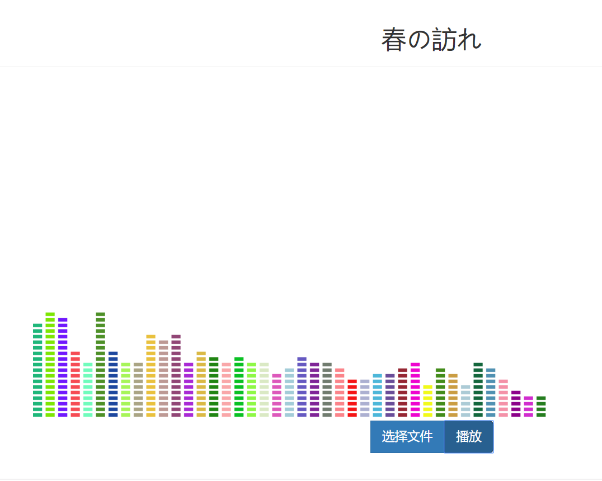
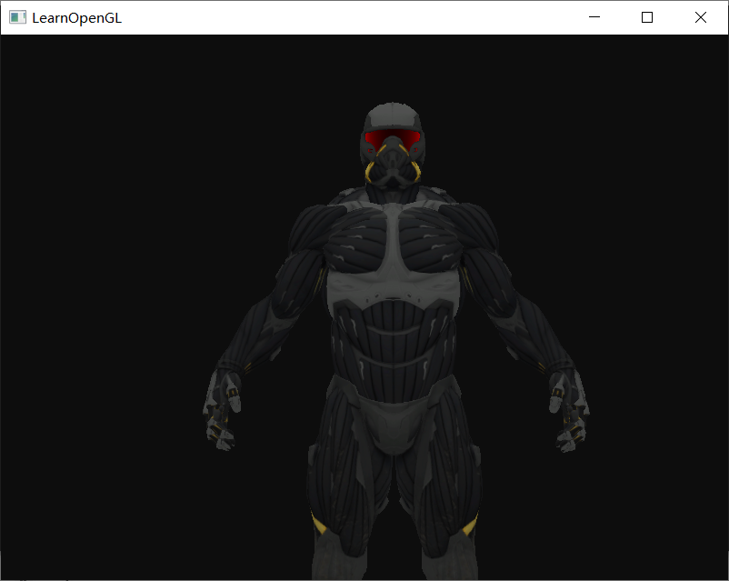
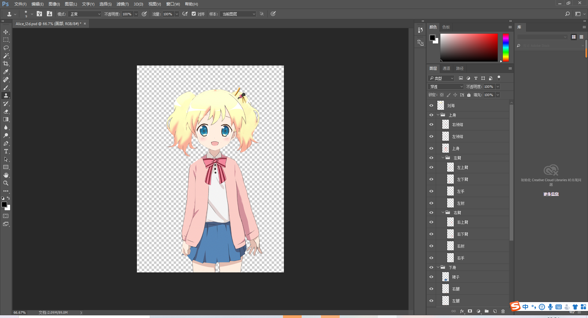
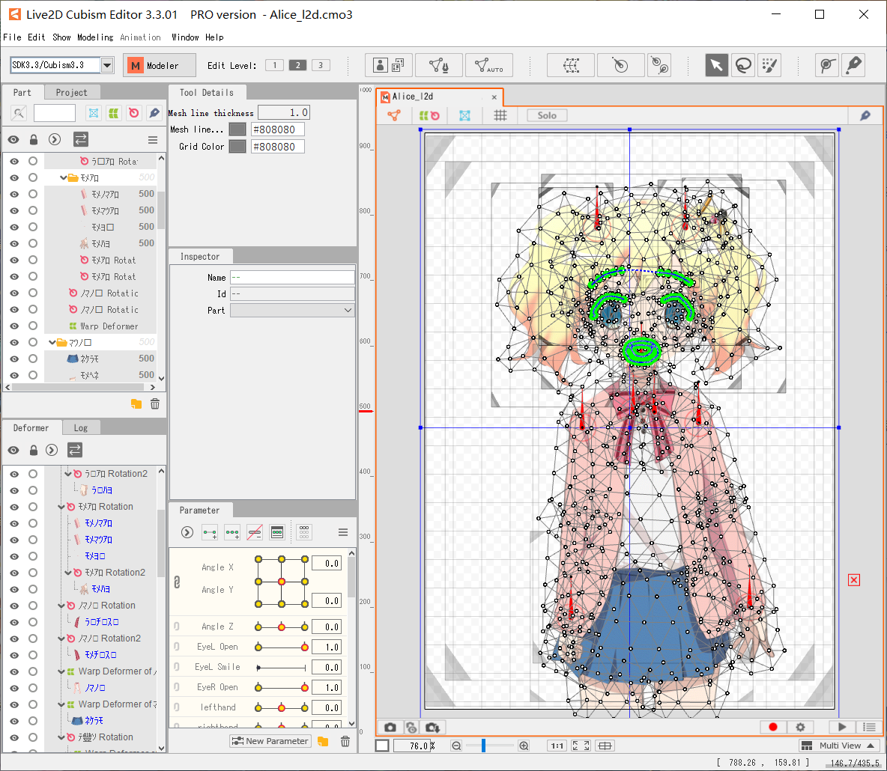

# 计算机图形学PJ报告
## 1. 音频可视化
### 1.1. 代码文件
musicvisualization.html，该文件是一个网页，打开即可运行。
### 1.2. 代码说明
该项目使用html编写，使用了AudioContext的API。

点击“选择文件”按钮选取需要播放的音频（mp3格式），在确定后会调用setName()函数，它会调用API，创建一个音频分析和增益控制节点，之后读取上传的音频并进行异步解码。
之后点击“播放”按钮就可以播放音频并可视化，效果如下：

点击该按钮时，会调用play()函数，它会首先判断是否在播放音频，若是就会停止。之后会调用initialbar()函数，它会初始化音频可视化界面。之后，它会调用AudioContext的API来播放音频并将音频与分析节点和增益控制节点相连。之后，在音频播放的过程中，程序会获得音频每一帧的频谱，并将其用柱状图可视化呈现。柱状图横轴是频率分布，纵轴表示幅值。柱状图的颜色随机生成。
### 1.3. 参考资料
[代码参考](https://github.com/whxaxes/canvas-test/tree/gh-pages/src/Funny-demo/musicPlayer)
[AudioContext API](https://developer.mozilla.org/zh-CN/docs/Web/API/AudioContext)
## 2. 真实感图形学
### 2.1. 项目文件
realObject文件夹。其中realObject.exe为可执行文件，main.cpp为主程序，openGL与resources文件夹里有相关库文件和资源。

运行时需要openGL的版本数至少为3。
### 2.2. 代码说明
该项目使用c语言编写，并使用了openGL。

直接运行realObject.exe即可看到一个模型，移动鼠标可以转换视角。效果如下：

main函数首先定义鼠标操作时的回调函数（它们在main.cpp的最后被实现，通过捕捉鼠标行为进行设置），设置常量并初始化摄像机。在main函数中，先初始化openGL版本，窗口大小等数据，使用GLFW库（它是创建OpenGL上下文，以及操作窗口的第三方库）。之后，让GLFW捕获鼠标事件，再加载GLAD库（它是访问OpenGL规范接口的第三方库）。加载着色器头文件和模型，然后在未关闭窗口时循环渲染：先清除上一帧的像素，再根据获得的鼠标移动判断如何对模型进行变换（使用GLM库，它为openGL提供数学运算支持），之后对模型进行变换并输出到屏幕上。
### 2.3. 参考资料
[opengl教程](https://learnopengl-cn.github.io/)
## 3. 动画
## 3.1. 源文件
Alice_l2d.cmo3是项目的工程文件，Untitled1.gif与Untitled2.gif是导出的动画。
## 3.2. 文件说明
该项目使用adobe photoshop进行原图片的拆分，并使用live2D Cubism 3.3 进行live2d动画的制作。原图片为手游“きんいろモザイクメモリーズ”中爱丽丝·卡塔雷特的一张卡面图。

拆分是把人物的身体部分尽可能的拆开方便运动，并补充上被遮挡的地方。psd拆分情况如下：

大体拆分为头发，面部，脖子，上身，下身五个部分，而每个部分又拆分成更小的部分。如左臂拆分成了左上臂，手肘，左下臂，手四个部分。

而live2d制作的情况如下：

live2d的本质是图像的变换，包括位移、旋转和形变。制作live2d时就是将上一步拆分的每一小部分进行变换的过程。对于每个部分的动作（如眼睛的睁闭，头的摇动等等），都需要相对应地进行形变。

以摇头为例，原始图片的头是初始状态，如果需要做向一侧歪头，就在结束处定义一个关键帧，并将头旋转一下作为该关键帧的状态。之后，程序会自动补充上中间的帧，从而形成动态效果。

上图表现了制作时的结构。白色圆圈是锚点，移动时会使得周围像素发生变化，从而产生形变；灰色方块负责设置整体形变；红色指针表示旋转轴；蓝绿色线条是骨架，它的变化会带动周围锚点进行移动，用于线条形变。整个live2d的制作就是对这些元素进行设置的过程。

接下来对以上元素进行处理，如法炮制制作其他部分的关键帧，就能生成一段动画。
## 3.3. 参考资料
B站的教程：“【Live2D官方教程】 Cubism 3.0”系列。